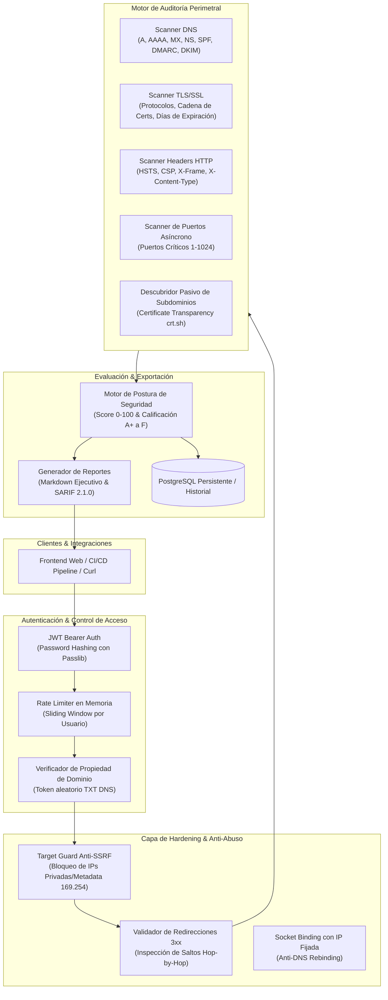

# SecuScan API

[](https://www.python.org/)
[](https://fastapi.tiangolo.com/)
[](https://pypi.org/project/pip-audit/)
[](tests/)
[](https://sarifweb.azurewebsites.net/)
[](Dockerfile)
[](LICENSE)

Backend API de alto rendimiento para auditoría perimetral y gestión de superficie de ataque externa (**External Attack Surface Management - EASM**). Evalúa la postura de seguridad de dominios y hosts autorizados mediante análisis de certificados TLS/SSL, cabeceras HTTP defensivas, registros de seguridad DNS (SPF/DMARC/DKIM), escaneo de puertos con mitigación de DNS rebinding, descubrimiento pasivo de subdominios vía Certificate Transparency (`crt.sh`), cálculo de **Security Posture Score (0-100 / A+ a F)** y generación de informes ejecutivos en Markdown y **SARIF 2.1.0**.

---

## 🏛️ Arquitectura del Sistema



---

## ✨ Capacidades Clave

### 1. Auditoría Perimetral Multidimensional
- **Descubrimiento Pasivo de Subdominios**: Consulta pública de logs de Certificate Transparency (`crt.sh`) para mapear subdominios activos sin enviar tráfico intrusivo al objetivo.
- **SSL / TLS Deep Inspection**: Detección de protocolos obsoletos (`TLS 1.0`, `TLS 1.1`, `SSLv3`), verificación de fecha de expiración, auto-firmado y algoritmos de firma débiles.
- **Cabeceras HTTP de Seguridad**: Validación estricta de `Strict-Transport-Security` (HSTS), `Content-Security-Policy` (CSP), `X-Content-Type-Options`, `X-Frame-Options` y `Referrer-Policy`.
- **Higiene de Correo y DNS**: Verificación sintáctica y de políticas de registros `SPF` (detectando configuraciones permisivas `~all` o `?all`), `DMARC` (p=reject/quarantine/none) y selectores `DKIM`.
- **Escaneo de Puertos Asíncrono con Anti-DNS Rebinding**: Resolución previa de IP y conexión directa por socket a nivel de IP para erradicar ataques de rebinding en escaneos de puertos (1–1024).

### 2. Motor de Calificación de Postura de Seguridad
- Puntuación matemática consolidada de 0 a 100 y asignación de letra de riesgo:
  - **`A+` (95-100)**: Postura defensiva óptima, cabeceras completas y cifrado moderno.
  - **`A` (85-94)**: Postura sólida con recomendaciones menores.
  - **`B` (70-84)**: Advertencias moderadas (faltan cabeceras secundarias o SPF permisivo).
  - **`C` / `D` (40-69)**: Exposición de riesgo (ausencia de HSTS/DMARC, certificados próximos a expirar).
  - **`F` (<40)**: Riesgo crítico (puertos de base de datos/RDP expuestos, certificado expirado o protocolos rotos).

### 3. Reportes Ejecutivos & SARIF 2.1.0
- **Markdown Ejecutivo**: Resumen ejecutivo con tablas comparativas, factores de penalización y plan de acción priorizado paso a paso.
- **OASIS SARIF 2.1.0**: Compatible con GitHub Code Scanning, GitLab Security Dashboard y DefectDojo.

### 4. Hardening de Producción y Defensas
- **Mitigación Anti-SSRF en Redirecciones**: HTTP client con inspección explícita de cada salto HTTP 3xx, neutralizando técnicas de redirección hacia `169.254.169.254` o redes locales `10.0.0.0/8`, `192.168.0.0/16`.
- **Verificación Criptográfica de Propiedad**: Prohíbe escaneo de infraestructura ajena requiriendo un registro TXT `_secuscan-challenge.<domain>` antes de autorizar escaneos.
- **Docker Hardened**: Ejecución en contenedor bajo usuario no privilegiado `appuser` (UID 1000).
- **Aislamiento de Base de Datos**: PostgreSQL restringido a la red interna virtual de Docker, sin exposición de puertos en el host de producción.

---

## 📡 Endpoints de la API

| Método | Endpoint | Descripción |
| :--- | :--- | :--- |
| `POST` | `/auth/register` | Registro de usuario con hash seguro (bcrypt) |
| `POST` | `/auth/login` | Autenticación y emisión de token JWT Bearer |
| `POST` | `/domains/verify/initiate` | Genera token aleatorio de verificación TXT DNS |
| `POST` | `/domains/verify/check` | Resuelve TXT y valida propiedad del dominio |
| `POST` | `/scan/headers` | Auditoría de cabeceras HTTP de seguridad |
| `POST` | `/scan/tls` | Inspección de certificados y protocolos TLS |
| `POST` | `/scan/dns` | Evaluación de SPF, DMARC y DKIM |
| `POST` | `/scan/ports` | Escaneo TCP de rango de puertos |
| `POST` | `/scan/subdomains` | Descubrimiento pasivo vía Certificate Transparency (`crt.sh`) |
| `POST` | `/scan/full` | Orquestación consolidada de todos los módulos + Posture Score |
| `GET`  | `/scans` | Historial paginado de escaneos del usuario |
| `GET`  | `/scans/{id}` | Detalle completo de hallazgos por módulo |
| `GET`  | `/scans/{id}/report` | Exportación de reporte (`format=markdown` o `format=sarif`) |

---

## 🚀 Inicio Rápido

### Requisitos
- Python 3.12+
- Docker & Docker Compose (para entorno productivo / Postgres)

### Instalación Local
```bash
# Clonar repositorio
git clone https://github.com/h3n-x/secuscan-api.git
cd secuscan-api

# Crear entorno virtual e instalar dependencias
python3 -m venv .venv
source .venv/bin/activate
pip install -r requirements-dev.txt

# Ejecutar pruebas unitarias
pytest tests/
```

### Ejecución con Docker Compose
```bash
docker compose -f docker-compose.prod.yml up -d --build
```

---

## 📄 Licencia

Este proyecto está licenciado bajo los términos de la licencia MIT.
